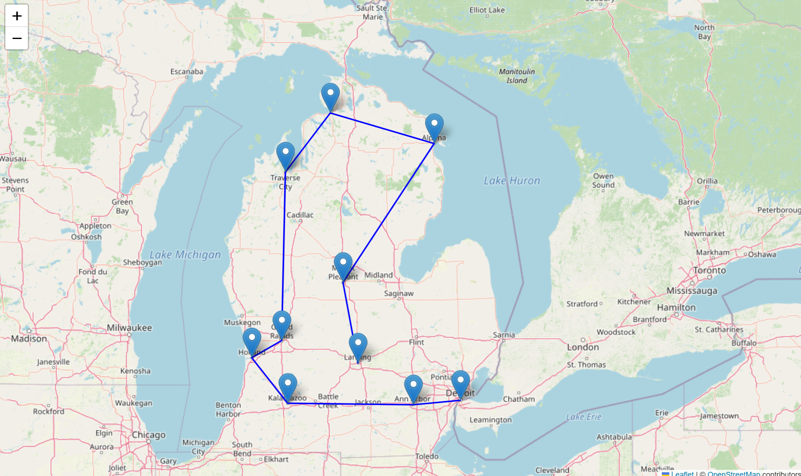

# CMSE202 Group 5: Optimize Delivery Route Planning for a Business    
**Group Members:** Rebecca Kingham, Peiyin Yang, Yunxin Lu, Itiel Castro, Quinn Brennan

---

## Introduction
Our project compares two different algorithms — **Brute Force** and **Nearest Neighbor** — to solve the **Traveling Salesman Problem (TSP)** using location data from 10 main cities in Michigan. The goal is to find the shortest possible route that visits each city once.

We use the **Google Maps Distance Matrix API** to gather real-world driving distances between cities and then visualize the results using the **folium** mapping library.In this project, we first model the Michigan state as a graph, where intersections are nodes and streets are edges. Then we compute the optimal route with several stops for agents to minimize delivery distance and time. The reason we use Google Maps API in this simulation is that creating a theoretical map ignores things like highways, detours, and road conditions, which are important in real-world applications.

---

## Tools & Libraries
- Python
- `googlemaps` (for distance and geocoding APIs, visit https://console.cloud.google.com/)
- `pandas`, `numpy`, `matplotlib` (for data handling and visualization)
- `folium` (for interactive route mapping)
- Google Maps API Key

---

## Two Algorithms and Assumptions

### 1. Brute Force
- Tries **every possible route** to find the shortest one.
- **Very accurate**, but **extremely slow** when the number of cities increases.
- Only practical for **small datasets** (less than ~10 locations).

### 2. Nearest Neighbor
- Starts at one city and always visits the **closest unvisited city**.
- **Much faster**, scales well to large datasets.
- May not always find the shortest route, but still performs **reasonably well**.

---

##  Results

| Algorithm        | Total Distance in meters|
|------------------|----------------|
| Brute Force      | 1019568      |
| Nearest Neighbor | 1364913      | 

- The **Nearest Neighbor route was about about **34% more** than Brute Force.
- Despite that, it ran significantly faster and completed the route generation almost instantly. The Brute Force algorithm took about 30 seconds to loop through all routes.

---

## Visualizations and Comparisons

  
Brute Force takes exponentially more steps as cities increase to about 10, Nearest Neighbor remains efficient and fast.

---

## Total Distance Comparison

  
Brute Force always finds the shortest route. Nearest Neighbor is faster, but its routes are slightly longer.

---

##  Route Map – Nearest Neighbor

  
Routes were plotted on an interactive map using **folium**.This map shows the Nearest Neighbor route with blue path. It's quick to compute and looks reasonable, but it's not always optimal. There's a few inefficient detours, especially around northern Michigan.

---

##  Route Map – Brute Force

  
This map with red path is the optimal route found using Brute Force. It’s shorter, but only practical for smaller datasets because larger datsets would take a lot of time to process.

---

##  Conclusion

- **Brute Force** is best when we need higher accuracy and the dataset is small.
- **Nearest Neighbor** is best for larger problems where speed matters and a "good enough" solution is acceptable.
- In real-world applications like delivery routing or travel planning, we recommend Nearest Neighbor for a balance between speed and performance.

---

##  Final Notes

- One challenge we faced:Google’s API can only handle 10 locations, we had to reduce the number of cities we choose for the test.
- For future improvements, we would consider trying **Genetic Algorithms** or **Simulated Annealing** for better optimization on larger datasets!

## Thanks for reading! To find our detailed code, please visit Project_notebook.ipynb in this repo!

